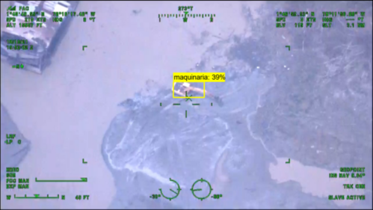

# CO2nscientes CODEFEST 2023

## Problema de detección de objetos

### Librerías necesarias

Para el desarrollo de este reto, la libreria core con la que se realizó la detección de objetos fue tensorflow

(Instalar las librerias requeridas en el requirements.txt)

### Proceso de trabajo

Primero hubo una etapa de creación de un modelo de detección de objetos:
- Basados en los videos que nos entregaron, con la herramienta v2 segmentamos el video en frames
- Los frames del video fueron examinados por una persona que se encargo de anotar cuando encontrara algo de interés (carros, barcos, zonas deforestadas, etc)
- Se creó un diccionario de imágenes, anotando elementos de interés con la herramienta labelImg.py
- tensorflow generó un modelo que podía identificar objetos en un frame

Luego hubo una segunda etapa que es la de creación de la herramienta
- Se registra cada 60 frames una imágen
- La imágen es pasada por una función que primero trata de identificar la hora y las coordenadas usando easyocr
- Luego la misma imágen es pasada por un proceso de detección de objetos usando el modelo anteriormente creado
- Finalmente si algún objeto es detectado en la imágen, esta pasa a guardarse y a ser registrado el valor en el csv

Imágen de una máquinaria identificada

